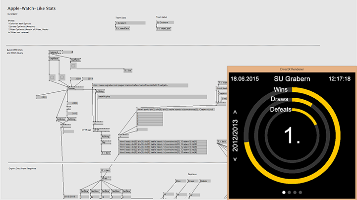
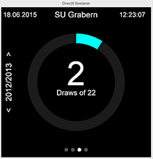
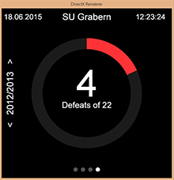
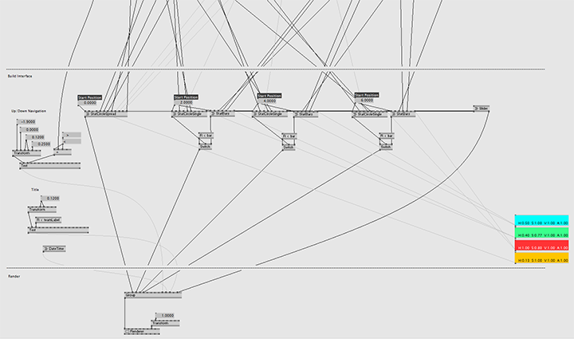

# Apple-Watch-Like Football Stats #

The project "Apple-Watch-Like Football Stats" deals with the visualization of data in the style of the Apple Watch (Health App). The data which is used are football tables from different seasons. The data is read and processed directly from a website.

The screen has a total of 4 pages which are displayed in a slider. With the Left/Right key it is possible to navigated between slides. The first section displays all wins, draws and defeats and the rank of a selected team. The other 3 slides show the wins, draws and defeats individually. In addition, you can switch to a bar graph in one of those three slides with the key "d" that shows all Wins/Draws/Defeats (depending on the slide) of all teams in the selected season. The season can be changes with the Up/Down keys.

The visualization is divided into 6 Patches:

* Main: The Main patch reads the data via the node "HTTP", converts it into clean XML ("Tidy") and extracts it with "XPath". The corresponding data is then passed to the respective sub-patches (Firebug is very helpful to find the XPath).
* Slider: The slider patch is attached to all charts and shifts the position of the charts while navigating. This could be further optimized in future that the slider is not connected to the charts, but the charts are connected to the slider.
* StatBars: Patch for the bar graphs.
* StatCircleSingle: Patch for pie charts with one circle.
* StatCircleSpread: Patch for pie charts with three circles. This could be optimized so that you can adjust how many circles you want in future.
* Datetime: Output of formatted date and time.

## Video ##

[Watch on YouTube](https://youtu.be/pWtano36W5k "YouTube")

## Screenshots ##

Caption

")
Caption

")
Caption

Caption

Caption

Caption
